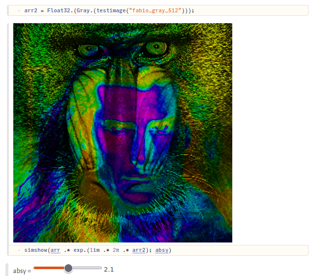

# SimpleImageView.jl
Visually looking at data - differently said: a simple image viewer
<br>

| **Build Status**                          | **Code Coverage**               |
|:-----------------------------------------:|:-------------------------------:|
| [![][CI-img]][CI-url] | [![][codecov-img]][codecov-url] |


Heavily based on [Colors.jl](https://github.com/JuliaGraphics/Colors.jl) and the ability to display such color types 
within [Pluto.jl](https://github.com/fonsp/Pluto.jl/) or [IJulia.jl (Jupyter notebooks)](https://github.com/JuliaLang/IJulia.jl).


## Installation
Not registered yet. 
```julia
julia> ]add https://github.com/roflmaostc/SimpleImageView.jl
```


## Features
* Display of real and complex values arrays
* Gamma correction
* clipping and contrast adjustment
* function application


## Examples
```julia
simshow(randn((2,2)))
simshow(rand(2,2), γ=0.1)
simshow(randn(ComplexF64, (2,2)))
simshow(randn(ComplexF64, (2,2)), absγ=0.1)
simshow(randn(ComplexF64, (2,2)), f = fft)
```


## Working in Pluto
A complex array can be easily display.
Using Pluto's interactivity, one can realize simple, and interactive viewers.




[codecov-img]: https://codecov.io/gh/roflmaostc/SimpleImageView.jl/branch/main/graph/badge.svg
[codecov-url]: https://codecov.io/gh/roflmaostc/SimpleImageView.jl

[CI-img]: https://github.com/roflmaostc/SimpleImageView.jl/actions/workflows/ci.yml/badge.svg
[CI-url]: https://github.com/roflmaostc/SimpleImageView.jl/actions/workflows/ci.yml
